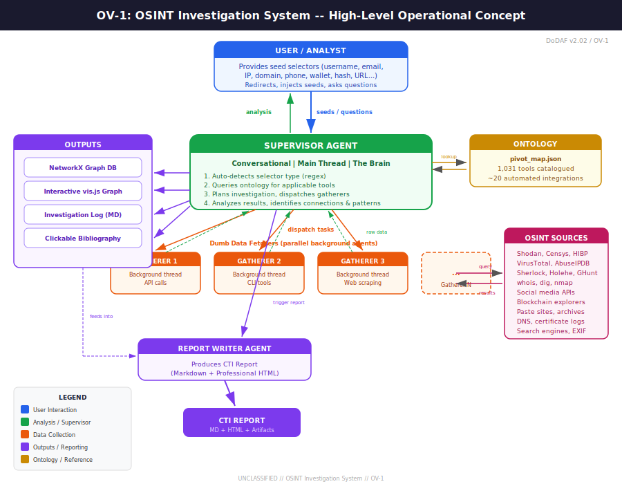

# OSINT Investigator

A multi-agent open source intelligence investigation system built on [Claude Code](https://docs.anthropic.com/en/docs/claude-code). Takes a seed selector — a username, email, IP address, domain, real name, phone number, cryptocurrency wallet, or any of 114 supported types — and systematically pivots through OSINT data sources, builds an entity graph, and produces a professional intelligence report.



## How It Works

```
/investigate someone@example.com
```

1. **Selector Detection** — Automatically identifies what you gave it (email, IP, username, etc.)
2. **Ontology Lookup** — Consults a knowledge base of 1,031 OSINT tools to determine what's available
3. **Supervisor Plans** — An AI supervisor agent plans the investigation and presents it to you
4. **Gatherers Execute** — Background agents run automated tools (WHOIS, DNS, Sherlock, crt.sh, etc.)
5. **Analysis** — The supervisor analyzes raw results, identifies connections and patterns
6. **You Direct** — Redirect the investigation, inject new seeds, or ask questions at any time
7. **Report** — A CTI report, interactive graph, and clickable bibliography are generated

### You Stay in Control

The supervisor runs conversationally in your terminal. While gatherer agents fetch data in the background, you can talk to the supervisor at any point:

- *"Focus on the infrastructure instead"*
- *"Also check this email: actor@evil.com"*
- *"What do we know about the nameservers so far?"*
- *"Stop — generate the report"*

## Live Investigation Outputs

Every investigation produces files that update in real-time. Open them in your browser and refresh as the investigation progresses:

| Output | Description |
|--------|-------------|
| **`graph.html`** | Interactive entity relationship graph (vis.js) — nodes colored by type, click for details |
| **`bibliography.html`** | Every discovered entity with clickable investigation links (Shodan, VirusTotal, WHOIS, HIBP, etc.) |
| **`investigation.md`** | Full audit trail — every tool execution with raw output in collapsible blocks |
| **`report.html`** | Professional CTI report — BLUF, findings, entity inventory, relationship map (Google Docs ready) |
| **`report.md`** | Markdown version of the CTI report |
| **`graph.json`** | Raw graph data for programmatic access |

## Architecture

```
User ←→ Supervisor Agent (conversational, main thread)
              │
              ├── Ontology (1,031 tools × 114 selector types)
              │
              ├──→ Gatherer Agent(s) (background, dumb data fetchers)
              │         │
              │         ├── WHOIS, DNS, crt.sh, Wayback...
              │         ├── Sherlock, Maigret (username enumeration)
              │         ├── Wikipedia, Wikidata, GitHub/GitLab...
              │         └── Shodan, IP geolocation, reverse DNS...
              │
              ├──→ Graph Database (NetworkX + JSON persistence)
              ├──→ Investigation Log (Markdown with raw output)
              ├──→ Bibliography (clickable investigation links)
              └──→ Report Writer Agent → CTI Report
```

**Key design principle**: Gatherers are dumb pipes that return raw tool output. The supervisor owns all analysis — identifying connections, assessing confidence, deciding next pivots. Every finding must cite exact tool output. No hallucination.

## Selector Ontology

The system maps **114 selector types** across 10 categories to **1,031 OSINT tools**:

| Category | Selector Types | Example |
|----------|---------------|---------|
| **Identity** | username, email, name, phone, telegram_handle, discord_id | `@johndoe`, `john@example.com` |
| **Infrastructure** | domain, ip_v4, ip_v6, url, asn, ssl_fingerprint | `example.com`, `8.8.8.8` |
| **Financial** | crypto_btc, crypto_eth, bank_account, credit_card_bin | `1A1zP1eP5QGefi2DMPTfTL5SLmv7DivfNa` |
| **Malware** | hash_md5, hash_sha256, yara_rule, cve_id | `d41d8cd98f00b204e9800998ecf8427e` |
| **Security** | password_hash, api_key, jwt_token | Credential fragments |
| **Media** | image, video, audio, exif_data | Image files for metadata |
| **Social** | social_media_post, blog_url, forum_post | Platform-specific content |
| **Geospatial** | coordinates, address, geohash | `38.8977,-77.0365` |
| **Transport** | license_plate, vin, vessel_imo, flight_number | Vehicle/vessel tracking |
| **Device** | mac_address, imei, bluetooth_id | Device identifiers |

See [docs/ontology-reference.md](docs/ontology-reference.md) for the complete reference.

### Automated Tools

These tools have working Python automation and run without API keys:

| Tool | Selector Types | What It Does |
|------|---------------|-------------|
| `whois_lookup` | domain | WHOIS registration data |
| `dns_lookup` | domain | A, MX, NS, TXT, CNAME records |
| `crtsh` | domain | SSL certificate transparency logs, subdomains |
| `wayback` | domain, url | Internet Archive historical snapshots |
| `http_headers` | domain, url | HTTP response headers and server info |
| `ip_geolocation` | ip_v4 | Geographic location, ISP, ASN |
| `reverse_dns` | ip_v4 | Reverse DNS lookup |
| `shodan_internetdb` | ip_v4 | Open ports, services, vulns (free, no key) |
| `ipinfo` | ip_v4 | IP metadata and organization |
| `sherlock` | username | Profile discovery across 400+ sites |
| `maigret` | username | Extended username enumeration |
| `holehe` | email | Which platforms an email is registered on |
| `emailrep` | email | Email reputation and activity |
| `wikipedia_search` | name, company | Wikipedia article search |
| `wikidata_search` | name, company | Structured data — occupations, employers, links |
| `gravatar_check` | name, email | Gravatar profile discovery |
| `name_to_username` | name | Username generation + GitHub/GitLab verification |
| `blockchain_btc` | crypto_btc | Bitcoin transaction history and balance |
| `etherscan` | crypto_eth | Ethereum address lookup |
| `urlscan` | domain, url, ip_v4 | urlscan.io scan results |
| `threatfox` | ip_v4, domain, hash | ThreatFox IOC database |
| `google_dork_generator` | all types | Generates targeted Google search queries |

The remaining 1,000+ tools in the ontology are catalogued with their input/output types — the system knows about them and can reference them even though they require manual use or API keys.

## Installation

### Prerequisites

- Python 3.10+
- [Claude Code](https://docs.anthropic.com/en/docs/claude-code) CLI
- Git

### Setup

```bash
git clone https://github.com/YOUR_USERNAME/osint-investigator.git
cd osint-investigator
pip install -r requirements.txt
```

### Optional Tools

For username enumeration (installed automatically on first use):
```bash
pip install sherlock-project
pip install maigret
pip install holehe
```

## Usage

### Start an Investigation

From Claude Code in the project directory:

```
/investigate <selector>
```

Examples:
```
/investigate johndoe                    # username
/investigate someone@example.com        # email
/investigate example.com                # domain
/investigate 8.8.8.8                    # IP address
/investigate "John Smith"               # real name
/investigate 1A1zP1eP5QGefi2DMPTfTL5SLmv7DivfNa  # BTC wallet
```

### During an Investigation

Talk to the supervisor naturally:
- Ask questions about findings
- Redirect focus to specific areas
- Inject new selectors to investigate
- Request specific tools be run
- Say "stop" to generate the final report

### View Results

Open the investigation directory in your browser:
```
investigations/INV-YYYYMMDD-NNN/
├── graph.html          # Interactive graph (refresh for updates)
├── bibliography.html   # Clickable investigation links
├── investigation.md    # Full audit trail
├── report.html         # Professional CTI report
├── report.md           # Markdown report
├── graph.json          # Raw graph data
└── state.json          # Investigation metadata
```

### Run Tools Directly

```python
from src.tools.execute import execute_tool, execute_all_for_selector

# Run a single tool
result = execute_tool("whois_lookup", "example.com", "domain",
                      graph_file="graph.json", log_file="log.md")

# Run all available tools for a selector type
results = execute_all_for_selector("example.com", "domain",
                                    graph_file="graph.json", log_file="log.md")
```

## Project Structure

```
osint-investigator/
├── .claude/commands/
│   └── investigate.md          # /investigate slash command
├── src/
│   ├── core/
│   │   ├── selector.py         # Selector type auto-detection
│   │   └── state.py            # Investigation state management
│   ├── ontology/
│   │   ├── selector_types.json # 114 selector type definitions
│   │   ├── tools_registry.json # 1,031 OSINT tool catalog
│   │   └── pivot_map.json      # Selector → tools → yields mapping
│   ├── tools/
│   │   ├── execute.py          # Unified execution (auto log/graph/bib)
│   │   ├── registry.py         # Tool loader and dispatcher
│   │   ├── base.py             # BaseTool / ToolResult interfaces
│   │   ├── domain_tools.py     # WHOIS, DNS, crt.sh, Wayback, headers
│   │   ├── ip_tools.py         # Geolocation, rDNS, Shodan, IPInfo
│   │   ├── username_tools.py   # Sherlock, Maigret
│   │   ├── email_tools.py      # Holehe, EmailRep
│   │   ├── name_tools.py       # Wikipedia, Wikidata, Gravatar, GitHub
│   │   ├── crypto_tools.py     # Blockchain.com, Etherscan
│   │   └── social_tools.py     # URLScan, ThreatFox, Google Dorks
│   ├── graph/
│   │   ├── database.py         # NetworkX graph with JSON persistence
│   │   └── visualizer.py       # vis.js HTML graph generator
│   ├── logger/
│   │   └── investigation_log.py # Markdown audit trail
│   └── report/
│       ├── cti_report.py       # Markdown CTI report
│       ├── html_report.py      # Professional HTML report
│       └── bibliography.py     # Clickable investigation links
├── skills/
│   ├── supervisor.md           # Supervisor agent instructions
│   ├── gatherer.md             # Gatherer agent instructions
│   └── report-writer.md       # Report writer agent instructions
├── ontology_viz/
│   └── ontology.html           # Interactive ontology visualization
├── docs/
│   ├── ov1-diagram.svg         # Operational concept diagram
│   └── ontology-reference.md   # Complete ontology documentation
├── investigations/             # Output directory (gitignored)
├── CLAUDE.md                   # Claude Code project config
├── requirements.txt
└── README.md
```

## Design Principles

1. **No Hallucination** — Every finding traces to a specific tool's raw output. The system distinguishes confirmed, probable, and possible confidence levels.

2. **Separation of Concerns** — Gatherer agents are dumb data pipes. The supervisor owns all analysis. The user owns all decisions.

3. **Full Audit Trail** — Every tool execution is logged with complete raw output. The investigation log is the evidence chain.

4. **Conservative Analysis** — The system cites exact output, distinguishes confirmed vs. inferred connections, and notes what it *didn't* find.

5. **Live Outputs** — The graph, bibliography, and log update after every tool execution. Open them in your browser and refresh.

6. **Extensible Ontology** — Adding a new tool means writing a Python wrapper and adding an entry to the pivot map. The ontology already catalogues 1,031 tools.

## CTI Report Format

Reports follow intelligence community standards:

- **BLUF** (Bottom Line Up Front) — 2-3 sentence summary
- **Significant Findings** — Cited with tool, timestamp, and confidence
- **Entity Inventory** — Every entity with type, source, confidence, and depth
- **Relationship Map** — Link to interactive graph
- **Investigation Method** — Tools used, pivot chain, duration
- **Implications** — Assessment based solely on confirmed findings

## License

MIT

## Acknowledgments

- Tool catalog expanded from [cipher387/osint_stuff_tool_collection](https://github.com/cipher387/osint_stuff_tool_collection)
- Graph visualization powered by [vis.js](https://visjs.org/)
- Built with [Claude Code](https://docs.anthropic.com/en/docs/claude-code) and the Claude Agent SDK
